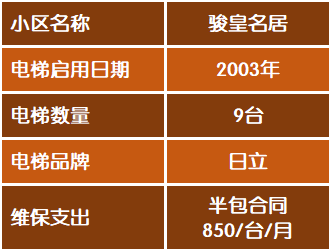

# 罗湖金岸小区电梯更新改造工程

## 人员：
业主委员会：召集业主讨论而制定计划，监督计划进展情况。组建电梯更新改造小组。

物业服务中心：提供指导和专业的技术支持。

电梯更新改造小组：实施电梯更新改造工程的具体事项。

## 参考资料：
- [骏皇名居电梯更新改造方案](https://sz.easyye.com/jhmj/thread-261-1-1.html)
- [香格丽苑业主垫资更换电梯经验全分享](https://mp.weixin.qq.com/s?__biz=MzA5ODk0MjA0MQ==&mid=2651318518&idx=1&sn=a8904fd887619687faeec44191464e14&chksm=8b7aa5c0bc0d2cd619a8e41409697902102213d52012564f57b302201ae4d886dea59f4da65c&mpshare=1&scene=1&srcid=11194MsMUcpGp7B00xLfB4lc#rd)
- 嘉宾花园更换电梯项目（离罗湖金岸不远，万象城斜对面，北方物业在管小区）
- 其他小区更换电梯项目

## 工作步骤：

1. 成立电梯更新改造小组
    + 1. 双丰收地方
    + 1. 是发送到发送到
1. 电梯更新改造小组制作出骏皇名居电梯更新改造方案问卷，了解业主的意向。（参考骏皇名居）

1. 业委会对问卷结果召开业主大会进行表决。
1. 实施完成电梯更新改造工程。

